# vLLM Serving Performance Lab: Tail Latency and Throughput Under Mixed Prompt Lengths (Overall, Short, Long p99)
**Quick links:** [Open in Colab](https://colab.research.google.com/drive/16_GJlYLGUKrZwf0lfQfSVbHuzFugCpjn?usp=sharing) · [Notebook (PDF)](notebook/vllm_serving_project.pdf) · [Artifacts (plots + CSVs)](artifacts/)

## Project Summary

A Colab-driven performance study of the latency–throughput (RPS) tradeoff in vLLM serving under concurrent, mixed prompt-length workloads. Alongside overall p50/p90/p99, it explicitly tracks **short p99 vs long p99 vs overall p99** to quantify head-of-line blocking and mixed-workload interference. The notebook also builds a deliberately **bad/unfair baseline** to demonstrate how poor knob choices can create throughput and tail-latency bottlenecks that **diminish chunked-prefill’s benefits**, before tuning toward a stable fair-scheduling configuration.

## How to run (Colab)

1. Open the Colab notebook and switch runtime to **GPU**.
2. Run cells **top-to-bottom** (or `Runtime → Run all`).
3. The notebook starts/stops a local **vLLM OpenAI-compatible server** (`127.0.0.1:8000`) and runs load sweeps against it.

**Test environment:** Experiments were run on **Google Colab with an NVIDIA L4 GPU**.

**Workloads:** JSONL promptsets (short_only, 90/10, 70/30, 50/50 mixes) are loaded directly by the notebook.

**Outputs:** Each experiment prints summary tables with **RPS + overall/short/long p50/p90/p99** and saves sweep results (CSV) for resume-capable runs.

## Experiments and key findings

### Experiment 1 — Mixed Prompt-Length Workloads (Baseline Stress Test)

**Goal:** Establish a baseline for the **latency–throughput tradeoff** under concurrent serving when prompt lengths are mixed. Measure **overall p50/p90/p99 + short p99 vs long p99** and observe interference effects.

**Workloads:** `short_only`, `mix_90_10`, `mix_70_30` (all at fixed concurrency).  
**Metrics:** success/fail, RPS, overall p50/p90/p99 (+ short/long splits tracked elsewhere in the notebook).

#### Key results (c = 8, 200 requests)
As the workload includes more long prompts, **tail latency increases and throughput drops**.

- **Throughput (RPS):** `2.53 → 2.29 → 1.96` (short_only → 90/10 → 70/30)
- **Overall p99 latency (s):** `3.59 → 4.53 → 5.38`
- **Overall p50 latency (s):** `3.55 → 3.62 → 4.10`

**Observed failure mode (important):** With fixed `max_tokens=128`, some mixed-workload requests can hit **context/token-limit overflow** (prompt + output > `max-model-len`), causing **HTTP 400 failures**.  
**Experiment 1.1** fixes this via **dynamic context budgeting**: shrink output tokens first, then trim input (head+tail) only if needed.

#### Takeaways
- **Mixed prompt lengths create interference:** long-prefill requests push up **tail latency** for everyone and reduce **effective RPS**.
- **The latency penalty is nonlinear:** moving from 90/10 to 70/30 shows a clear tail expansion (p99 grows faster than p50).
- **Hard failures can appear with naive token settings:** fixed output caps are not safe under variable prompt lengths without budgeting.

#### Artifacts
**Summary table:** [`artifacts/exp1/tables/exp01_results_summary.csv`](artifacts/exp1/tables/exp01_results_summary.csv)

**Plots (Exp 1):**

<table>
  <tr>
    <th align="center">Latency percentiles by workload</th>
    <th align="center">Throughput (RPS) by workload</th>
  </tr>
  <tr>
    <td align="center">
      
    </td>
    <td align="center">
      
    </td>
  </tr>

  <tr>
    <th align="center" colspan="2">Latency histograms</th>
  </tr>

  <tr>
    <th align="center">short_only</th>
    <th align="center">mix_90_10</th>
  </tr>
  <tr>
    <td align="center">
      
    </td>
    <td align="center">
      
    </td>
  </tr>

  <tr>
    <th align="center">mix_70_30</th>
    <th align="center"></th>
  </tr>
  <tr>
    <td align="center">
      
    </td>
    <td align="center">&nbsp;</td>
  </tr>
</table>

### Experiment 1.1 — Dynamic Context Budgeting (Prevent Token-Limit 400s)

**Goal:** Eliminate **HTTP 400 context/token-limit failures** caused by naive fixed `max_tokens` when prompt lengths vary. Guarantee a minimum completion size while keeping requests within `max-model-len`.

**What changed vs Exp 1:** Instead of always using a fixed output cap (e.g., `max_tokens=128`), the notebook builds each request with a **token budget**:

1. **Estimate prompt tokens** using the model’s chat template (`apply_chat_template`).
2. **Shrink output tokens first**:  
   `max_out = min(desired_max_tokens, MAX_MODEL_LEN - safety_margin - prompt_tokens)`
3. If there still isn’t room for a minimum output (`max_out < MIN_OUTPUT_TOKENS`), **trim the input** (user content only) using a **head+tail token trim** (keeps the start + end, drops the middle) until the prompt fits.
4. Final guard ensures `max_out > 0`, otherwise error.

This preserves “what matters” in long prompts (instructions at the start + relevant details near the end) while ensuring the server never receives an over-limit request.

#### Key results (c = 8, 200 requests)
With dynamic budgeting enabled, the same workloads complete **without failures** (no token-limit 400s), while keeping latency/throughput behavior comparable to Exp 1.

- **Failures:** `0/200` for `short_only`, `mix_90_10`, `mix_70_30`
- **Throughput (RPS):** `2.52 → 2.27 → 1.94`
- **Overall p99 latency (s):** `3.58 → 4.53 → 5.39`

#### Takeaways
- **Dynamic max_tokens is mandatory under variable prompt lengths** if you want reliability (prevents hard 400s).
- **Best-first strategy:** shrink output tokens before touching the prompt; only trim input when absolutely required.
- **Head+tail trimming is a safe fallback** for extreme prompts because it preserves both instructions (head) and the most recent/likely-relevant content (tail).

#### Artifacts
**Summary table:** [`artifacts/exp1_1/tables/exp01_1_results_summary.csv`](artifacts/exp1_1/tables/exp01_1_results_summary.csv)

### Experiment 2 — Deliberately “Bad/Unfair” Baseline (Head-of-Line Blocking)

**Goal:** Create a **known-bad baseline** that reproduces real failure modes under mixed prompt lengths—especially **head-of-line (HoL) blocking**, where long-prefill requests dominate batching and delay short requests. This also demonstrates that **even with chunked prefill available (vLLM v1)**, **poor knob choices can diminish its benefits**.

**Rationale:** If we can make the system fail predictably with a “bad” config, then later experiments can show which knobs actually fix the bottlenecks (and how much).

**What makes the config “bad”:**
- Set **`--max-num-batched-tokens` very high** (e.g., 8192) while leaving **`--max-num-seqs` unconstrained/high**.
- This encourages vLLM to pack **large prefills** into a batch.
- Under mixed workloads, long prompts can consume most of the batch budget → **short requests wait behind long prefills** → short p99 inflates.

**Workload:** Mixed prompt-length JSONL (e.g., 50/50 short vs long).  
**Metrics tracked:** RPS + **overall p50/p90/p99** + **short p99 vs long p99** (to quantify mixed-workload interference).

#### Expected behavior / failure mode
- **Overall p99 grows sharply** as queueing increases.
- **Short p99 approaches long p99** (short requests get “dragged” by long-prefill batches).
- Throughput may look “okay-ish” while tails become unacceptable → classic **throughput vs tail** trap.

#### Artifacts
**Summary table:** [`artifacts/exp2/tables/expt2_results_bad_config.csv`](artifacts/exp2/tables/expt2_results_bad_config.csv)

### Experiment 3 — Concurrency Sweep (BAD/Unfair Baseline)

**Goal:** Hold workload constant (`mix_50_50`) and sweep **concurrency** to measure how **throughput (RPS)** and **tail latency** evolve as the system transitions into queueing/backlog.

**Setup:** `mix_50_50.jsonl`, `max_tokens=16`, total requests = **200** per run  
**Concurrency sweep:** `1, 2, 4, 8, 16, 32, 48, 64`  
**Label:** `BAD_unfair` (deliberately poor config to surface interference)

#### Takeaways
- **Throughput rises then saturates (knee around `c≈16–32`)**: RPS climbs quickly (`~1.3 → ~5.9`) by **c=16**, then largely **flattens** (`~5.9–6.0`) while latency keeps worsening.
- **Tail latency inflates fast after the knee**: overall **p99 jumps ~6.2s → ~9.5s → ~13.8s → ~21.7s** as `c=16 → 32 → 48 → 64`.
- **Short requests get punished by long-prefill contention**: short **p99 grows ~4.0s → ~7.2s → ~11.3s → ~15.8s** from `c=16 → 32 → 48 → 64` (classic mixed-workload interference).
- **Overall p99 tracks long-prefill pressure**: long **p99 ~6.2s (c=16) → ~10.2s (c=32) → ~21.9s (c=64)**, and overall p99 follows the same curve.

#### Artifacts
**Summary table:** [`artifacts/exp3/tables/exp3_results.csv`](artifacts/exp3/tables/exp3_results.csv)

**Plots (Exp 3):**

<table>
  <tr>
    <th align="center">Throughput vs concurrency</th>
    <th align="center">Overall p99 vs concurrency</th>
  </tr>
  <tr>
    <td align="center">
      
    </td>
    <td align="center">
      
    </td>
  </tr>

  <tr>
    <th align="center">Overall p50 vs concurrency</th>
    <th align="center">Overall p90 vs concurrency</th>
  </tr>
  <tr>
    <td align="center">
      
    </td>
    <td align="center">
      
    </td>
  </tr>

  <tr>
    <th align="center">p99 vs RPS</th>
    <th align="center">Short vs Long p99 vs concurrency</th>
  </tr>
  <tr>
    <td align="center">
      
    </td>
    <td align="center">
      
    </td>
  </tr>

  <tr>
    <th align="center">Tail inflation vs concurrency</th>
    <th align="center"></th>
  </tr>
  <tr>
    <td align="center">
      
    </td>
    <td align="center">&nbsp;</td>
  </tr>
</table>

### Experiment 4 — 2D Sweep: Concurrency × `max_num_seqs` (BAD / unfair config)

**Goal:** Stress-test a deliberately “bad” vLLM configuration on a mixed workload (`mix_50_50`) and quantify how **throughput** and **tail latency** behave as we increase (1) client concurrency and (2) server admission capacity (`max_num_seqs`). This exposes **where throughput stops scaling**, where **queueing dominates**, and how **long-prefill contention** inflates tail latency.

**Workload:** `mix_50_50.jsonl`  
**Sweep:** `concurrency ∈ {1,2,4,8,16,32,48,64}` × `max_num_seqs ∈ {16,32,48,64,80,96}`  
**Per run:** 200 requests, `desired_max_tokens=16` (token-budgeted)

#### Key takeaways (with rough numbers)
- **Throughput scaling + knee:** RPS increases with concurrency, but shows **diminishing returns around ~c=32** for many settings.  
  Example: with smaller admission (`max_num_seqs=16`), RPS grows from **~1.3 (c=1)** → **~11.0 (c=16)** → **~13.6 (c=64)** (flattening beyond ~c=32).

- **Tail latency inflation under load:** Tail grows much faster than median once queueing kicks in.  
  Example (`max_num_seqs=16`): **short p99 ~0.46s (c=1)** → **~1.88s (c=16)** → **~5.55s (c=64)**.  
  Long requests also inflate: **long p99 ~1.31s (c=1)** → **~2.24s (c=16)** → **~5.95s (c=64)**.

- **Effect of `max_num_seqs`:** Larger `max_num_seqs` can unlock higher mid/high-load throughput, but can **worsen tails** if it admits too many sequences and amplifies contention/queueing in this BAD setup.  
  At high load (`c=64`), RPS reaches **~20 rps** in the best cases (e.g., `max_num_seqs≈64–80`), but tails can still be several seconds (and worse for overly-admissive settings like `max_num_seqs=96`).

#### Artifacts
**Summary table:** [`artifacts/exp4/tables/exp4_result_summary.csv`](artifacts/exp4/tables/exp4_result_summary.csv)

**Plots (Exp 4):**

<table>
  <tr>
    <th align="center">BAD grid: RPS heatmap</th>
    <th align="center">BAD grid: short p99 heatmap</th>
  </tr>
  <tr>
    <td align="center">
      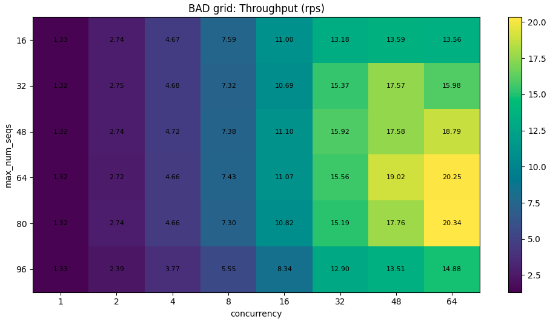
    </td>
    <td align="center">
      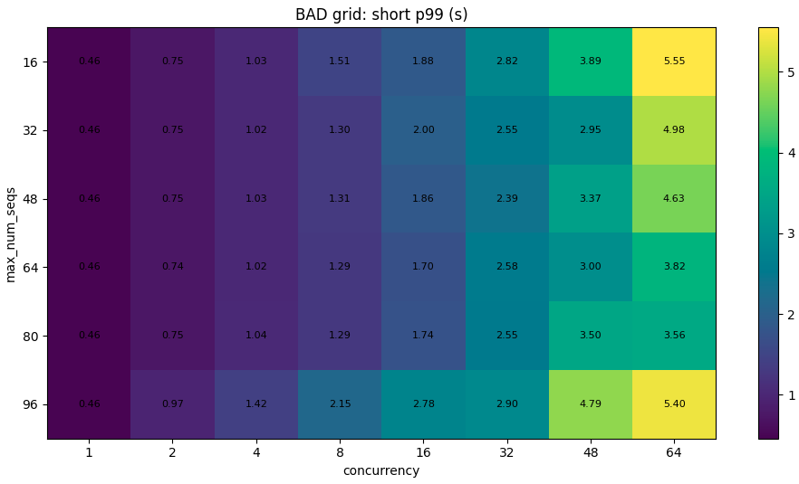
    </td>
  </tr>

  <tr>
    <th align="center">BAD grid: long p99 heatmap</th>
    <th align="center">BAD: RPS vs concurrency (by max-num-seqs)</th>
  </tr>
  <tr>
    <td align="center">
      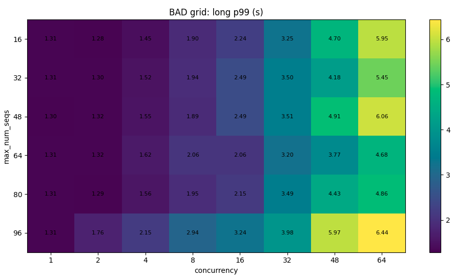
    </td>
    <td align="center">
      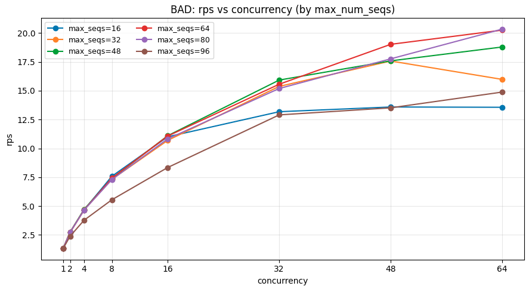
    </td>
  </tr>

  <tr>
    <th align="center">BAD: short p99 vs concurrency (by max-num-seqs)</th>
    <th align="center">BAD: long p99 vs concurrency (by max-num-seqs)</th>
  </tr>
  <tr>
    <td align="center">
      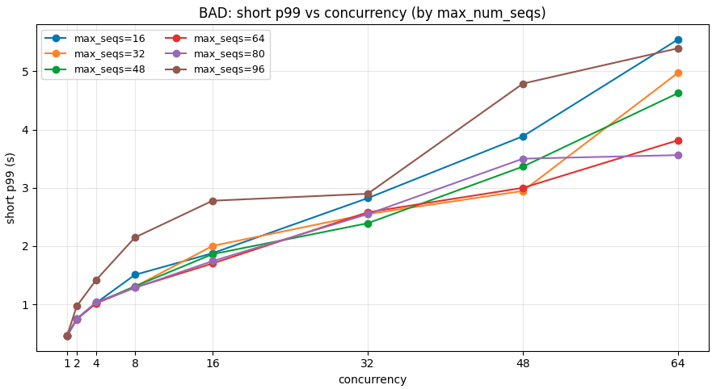
    </td>
    <td align="center">
      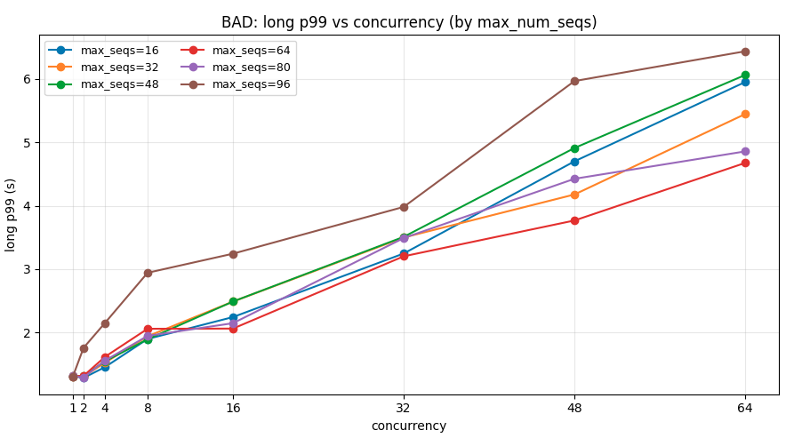
    </td>
  </tr>
</table>

## Experiment 5: Creating FAIR scheduling (latency ↔ throughput trade-off)

This experiment introduces a **FAIR scheduling / token-budget strategy** to reduce mixed-workload interference (short requests getting stuck behind long-prefill work). We progressively evaluate:

1) a **single sanity-check** (FAIR vs BAD at the same concurrency),
2) a **1D sweep** over `max-num-batched-tokens` (btok) at two concurrencies,
3) a **2D grid sweep**: `btok × max-num-seqs` at `c=32`.

---

### 5.1 Fair sanity check (btok=768 @ c=32)

We reduce `max-num-batched-tokens` from the BAD baseline (`8192`) down to **768**, holding everything else constant and testing at **the same concurrency (`c=32`)**.

- **Goal:** verify `btok` is a real lever under mixed 50/50 traffic.
- **Result (vs BAD @ c=32):**
  - Overall: **p50 worsens** (**6.04s vs 5.53s**), **p90 improves** (**9.18s vs 10.46s**), **p99 ~flat** (~**11.06s**).
  - Short: **p50 worsens** (**5.63s vs 4.70s**), **short p99 slightly improves** (**10.08s vs 10.15s**).
  - Long: **p90 improves** (**10.00s vs 10.96s**), **long p99 ~flat** (~**11.11s vs 11.06s**).

**Interpretation:** lowering btok reshapes the distribution (notably p90), but **does not reliably reduce worst-case p99** at this load.

---

### 5.2 `max-num-batched-tokens` sweep @ c=16

At `c=16`, increasing btok from **256 → 2048** improves both median and tail:

- Overall p99 improves **7.49s → 5.88s** (~**−21.5%**)
- Long p99 improves **7.64s → 5.97s** (~**−21.9%**)
- Overall p50 improves **3.92s → 2.88s** (~**−26.6%**)

**Interpretation:** the server is **prefill/batching-throttled** at low btok in this regime.

---

### 5.3 `max-num-batched-tokens` sweep @ c=32 (knee + tail tradeoffs)

At `c=32`, btok acts mainly as a **throughput lever**, while tails are non-monotonic:

- RPS rises **3.97 rps @ 256 → 5.48 rps @ 3072** (**+38.1%**)
- p50 improves **8.03s @ 256 → 5.13s @ 3072** (**−36.2%**)
- Beyond **2048–3072**, throughput **plateaus (~5.2–5.5 rps)** while **long/overall tails can worsen**.

**Interpretation:** under high load, btok tuning alone doesn’t guarantee better p99 — queueing variance dominates.

---

### 5.4 2D sweep: `btok × max-num-seqs` @ c=32

We sweep **btok ∈ {512..8192}** and **max-num-seqs ∈ {32..128}** at `c=32`.

- FAIR throughput varies modestly (**~4.30 → ~5.19 rps**) but tails move a lot.
- Best short-tail protection observed:
  - **btok=6144, max-num-seqs=96** → **short p99 ≈ 9.53s** (vs BAD short p99 ≈ **10.15s**; ~**6.1% lower**), but long p99 increases (~**13.09s**).
- Most conservative long-tail region:
  - **btok=512, max-num-seqs=32** → **long p99 ≈ 11.80s** (closest-to-best within FAIR), with RPS ≈ **4.77**.

**Takeaway:** there is no single “best” FAIR config — it depends on the SLO:
- Optimize **short p99** → higher-btok / moderate-seqs region (e.g., `6144 × 96`)
- Optimize **long p99** → conservative corner (e.g., `512 × 32`)
- Production choice is typically the **knee**: near-peak RPS without large p99 inflation, then validate via a final concurrency sweep.

---

---

## Artifacts (Exp 5)

### Tables
- [exp5_fair_c32_btok768.csv](artifacts/exp5/tables/exp5_fair_c32_btok768.csv)
- [exp5_fair_btok_sweep_c16.csv](artifacts/exp5/tables/exp5_fair_btok_sweep_c16.csv)
- [exp5_fair_btok_sweep_c32.csv](artifacts/exp5/tables/exp5_fair_btok_sweep_c32.csv)
- [exp5_fair_c32_btok_max_num_seqs.csv](artifacts/exp5/tables/exp5_fair_c32_btok_max_num_seqs.csv)

---

### Plots (FAIR vs BAD overview)

<table>
  <tr>
    <td align="center" width="50%">
      <b>FAIR grid: RPS heatmap</b> 
      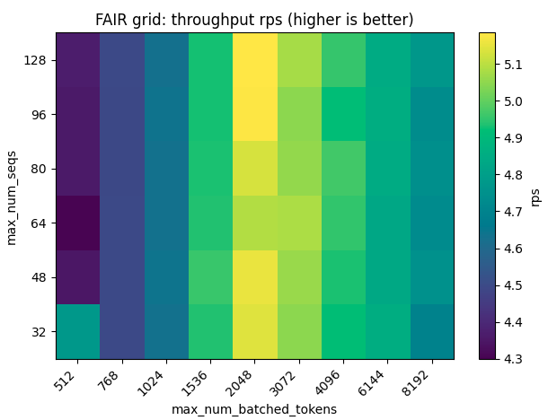
    </td>
    <td align="center" width="50%">
      <b>FAIR grid: short p99 heatmap</b> 
      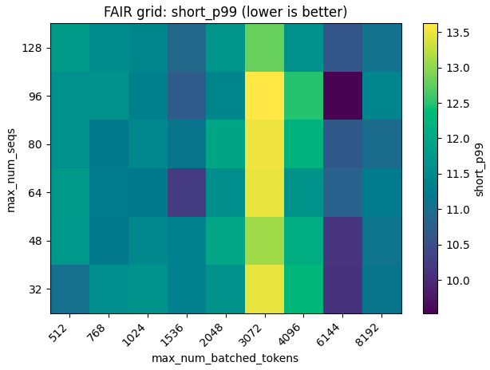
    </td>
  </tr>
  <tr>
    <td align="center" width="50%">
      <b>BAD grid: RPS heatmap</b> 
      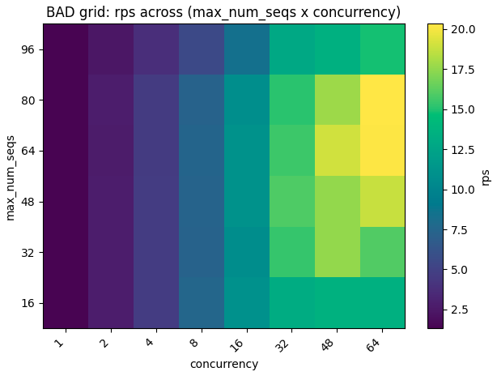
    </td>
    <td align="center" width="50%">
      <b>BAD grid: short p99 heatmap</b> 
      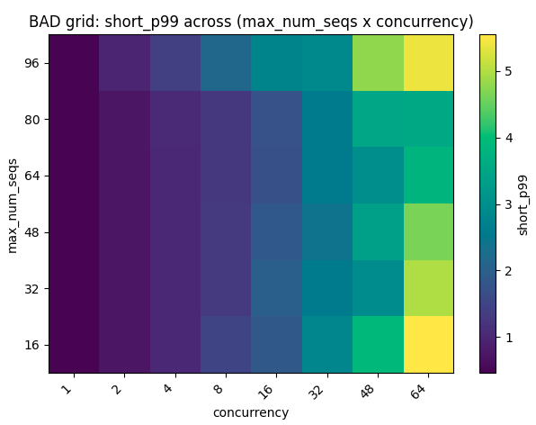
    </td>
  </tr>
  <tr>
    <td align="center" width="50%">
      <b>FAIR Pareto: RPS vs short p99</b> 
      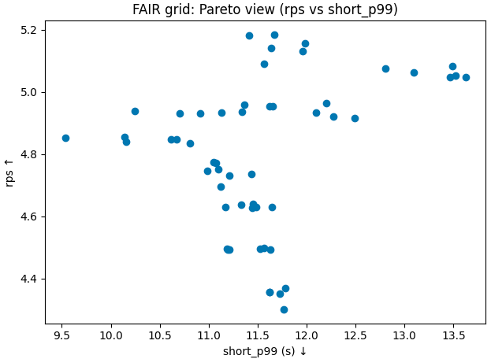
    </td>
    <td align="center" width="50%">
      <b>BAD Pareto: RPS vs short p99</b> 
      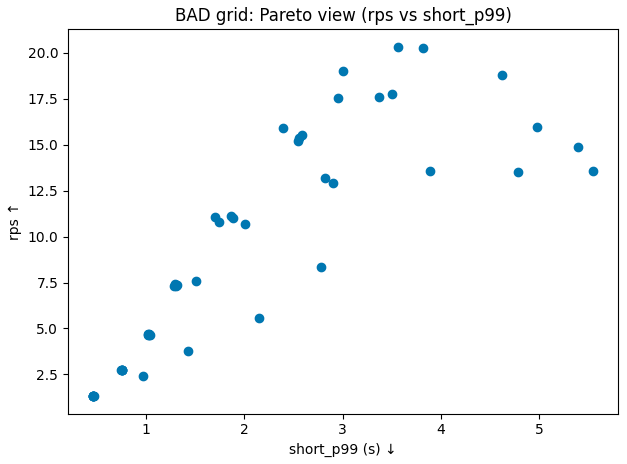
    </td>
  </tr>
  <tr>
    <td align="center" width="50%">
      <b>FAIR vs BAD: RPS vs Δ(short p99)</b> 
      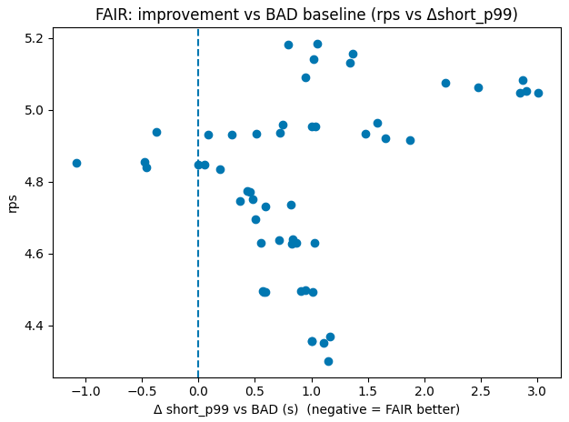
    </td>
    <td align="center" width="50%">
      <!-- keep empty to preserve alignment -->
      &nbsp;
    </td>
  </tr>
</table>

---

### Plots (Short p99 vs max-num-seqs slices by token budget)

<table>
  <tr>
    <td align="center" width="50%">
      <b>Short p99 vs max-num-seqs (btok=512)</b> 
      
    </td>
    <td align="center" width="50%">
      <b>Short p99 vs max-num-seqs (btok=768)</b> 
      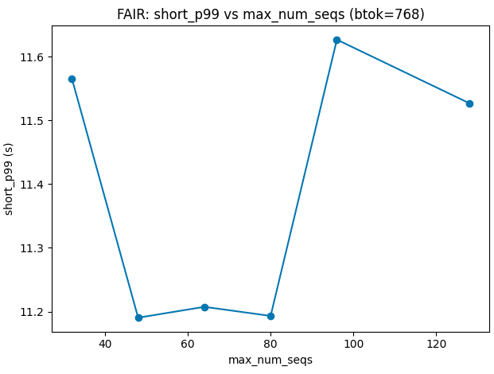
    </td>
  </tr>
  <tr>
    <td align="center" width="50%">
      <b>Short p99 vs max-num-seqs (btok=1024)</b> 
      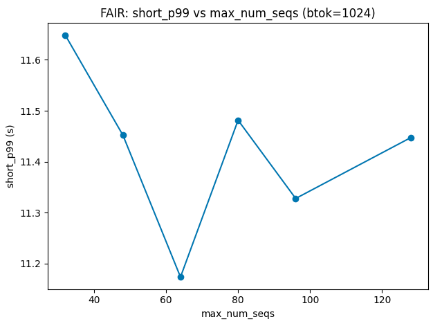
    </td>
    <td align="center" width="50%">
      <b>Short p99 vs max-num-seqs (btok=1536)</b> 
      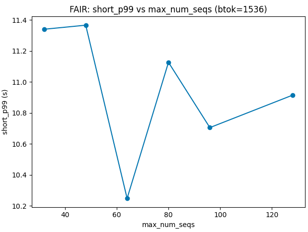
    </td>
  </tr>
  <tr>
    <td align="center" width="50%">
      <b>Short p99 vs max-num-seqs (btok=2048)</b> 
      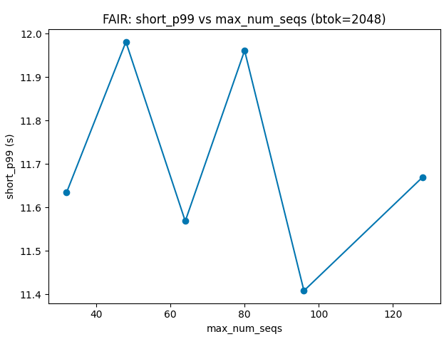
    </td>
    <td align="center" width="50%">
      <b>Short p99 vs max-num-seqs (btok=3072)</b> 
      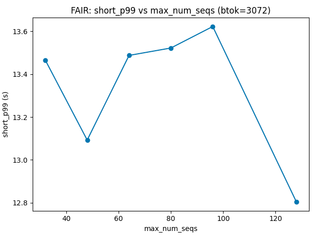
    </td>
  </tr>
  <tr>
    <td align="center" width="50%">
      <b>Short p99 vs max-num-seqs (btok=4096)</b> 
      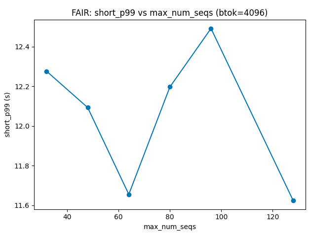
    </td>
    <td align="center" width="50%">
      <b>Short p99 vs max-num-seqs (btok=6144)</b> 
      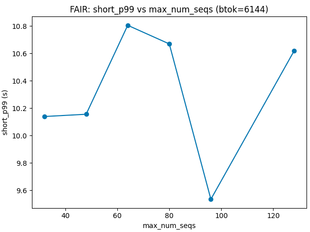
    </td>
  </tr>
  <tr>
    <td align="center" width="50%">
      <b>Short p99 vs max-num-seqs (btok=8192)</b> 
      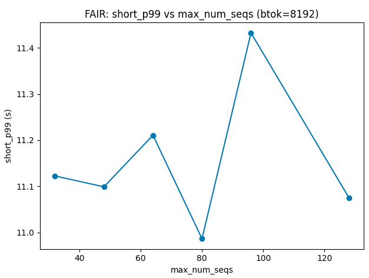
    </td>
    <td align="center" width="50%">
      <!-- keep empty to preserve alignment -->
      &nbsp;
    </td>
  </tr>
</table>

---

