# vLLM Serving Performance Lab: Tail Latency and Throughput Under Mixed Prompt Lengths (Overall, Short, Long p99)
**Quick links:** [Open in Colab](https://colab.research.google.com/drive/16_GJlYLGUKrZwf0lfQfSVbHuzFugCpjn?usp=sharing) · [Notebook (PDF)](notebook/vllm_serving_project.pdf) · [Artifacts (plots + CSVs)](artifacts/)

## Project Summary

A Colab-driven performance study of the latency–throughput (RPS) tradeoff in vLLM serving under concurrent, mixed prompt-length workloads. Alongside overall p50/p90/p99, it explicitly tracks **short p99 vs long p99 vs overall p99** to quantify head-of-line blocking and mixed-workload interference. The notebook also builds a deliberately **bad/unfair baseline** to demonstrate how poor knob choices can create throughput and tail-latency bottlenecks that **diminish chunked-prefill’s benefits**, before tuning toward a stable fair-scheduling configuration.

## How to run (Colab)

1. Open the Colab notebook and switch runtime to **GPU**.
2. Run cells **top-to-bottom** (or `Runtime → Run all`).
3. The notebook starts/stops a local **vLLM OpenAI-compatible server** (`127.0.0.1:8000`) and runs load sweeps against it.

**Test environment:** Experiments were run on **Google Colab with an NVIDIA L4 GPU**.

**Workloads:** JSONL promptsets (short_only, 90/10, 70/30, 50/50 mixes) are loaded directly by the notebook.

**Outputs:** Each experiment prints summary tables with **RPS + overall/short/long p50/p90/p99** and saves sweep results (CSV) for resume-capable runs.

## Experiments and key findings

### Experiment 1 — Mixed Prompt-Length Workloads (Baseline Stress Test)

**Goal:** Establish a baseline for the **latency–throughput tradeoff** under concurrent serving when prompt lengths are mixed. Measure **overall p50/p90/p99 + short p99 vs long p99** and observe interference effects.

**Workloads:** `short_only`, `mix_90_10`, `mix_70_30` (all at fixed concurrency).  
**Metrics:** success/fail, RPS, overall p50/p90/p99 (+ short/long splits tracked elsewhere in the notebook).

#### Key results (c = 8, 200 requests)
As the workload includes more long prompts, **tail latency increases and throughput drops**.

- **Throughput (RPS):** `2.53 → 2.29 → 1.96` (short_only → 90/10 → 70/30)
- **Overall p99 latency (s):** `3.59 → 4.53 → 5.38`
- **Overall p50 latency (s):** `3.55 → 3.62 → 4.10`

**Observed failure mode (important):** With fixed `max_tokens=128`, some mixed-workload requests can hit **context/token-limit overflow** (prompt + output > `max-model-len`), causing **HTTP 400 failures**.  
**Experiment 1.1** fixes this via **dynamic context budgeting**: shrink output tokens first, then trim input (head+tail) only if needed.

#### Takeaways
- **Mixed prompt lengths create interference:** long-prefill requests push up **tail latency** for everyone and reduce **effective RPS**.
- **The latency penalty is nonlinear:** moving from 90/10 to 70/30 shows a clear tail expansion (p99 grows faster than p50).
- **Hard failures can appear with naive token settings:** fixed output caps are not safe under variable prompt lengths without budgeting.

#### Artifacts
**Summary table:** [`artifacts/exp1/tables/exp01_results_summary.csv`](artifacts/exp1/tables/exp01_results_summary.csv)

**Plots (Exp 1):**

| Latency percentiles by workload | Throughput (RPS) by workload |
|---|---|
| 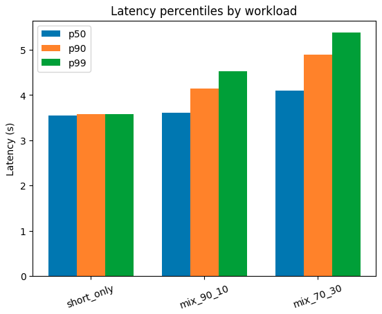 | 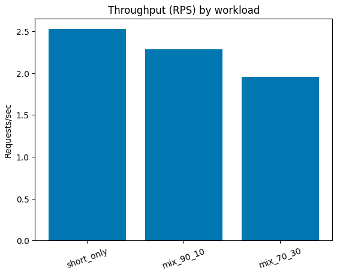 |

- Latency histograms

| short_only | mix_90_10 |
|---|---|
| 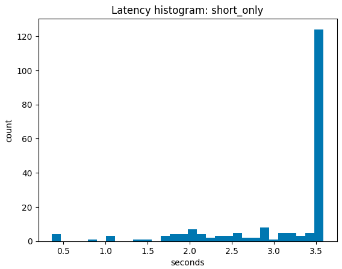 | 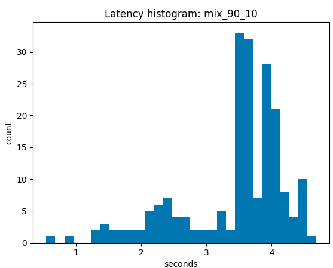 |

| mix_70_30 |  |
|---|---|
| 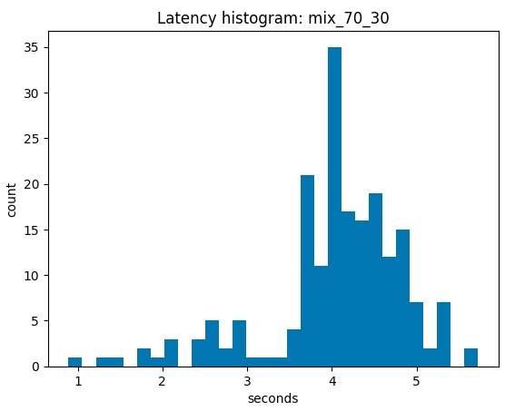 |  |

### Experiment 1.1 — Dynamic Context Budgeting (Prevent Token-Limit 400s)

**Goal:** Eliminate **HTTP 400 context/token-limit failures** caused by naive fixed `max_tokens` when prompt lengths vary. Guarantee a minimum completion size while keeping requests within `max-model-len`.

**What changed vs Exp 1:** Instead of always using a fixed output cap (e.g., `max_tokens=128`), the notebook builds each request with a **token budget**:

1. **Estimate prompt tokens** using the model’s chat template (`apply_chat_template`).
2. **Shrink output tokens first**:  
   `max_out = min(desired_max_tokens, MAX_MODEL_LEN - safety_margin - prompt_tokens)`
3. If there still isn’t room for a minimum output (`max_out < MIN_OUTPUT_TOKENS`), **trim the input** (user content only) using a **head+tail token trim** (keeps the start + end, drops the middle) until the prompt fits.
4. Final guard ensures `max_out > 0`, otherwise error.

This preserves “what matters” in long prompts (instructions at the start + relevant details near the end) while ensuring the server never receives an over-limit request.

#### Key results (c = 8, 200 requests)
With dynamic budgeting enabled, the same workloads complete **without failures** (no token-limit 400s), while keeping latency/throughput behavior comparable to Exp 1.

- **Failures:** `0/200` for `short_only`, `mix_90_10`, `mix_70_30`
- **Throughput (RPS):** `2.52 → 2.27 → 1.94`
- **Overall p99 latency (s):** `3.58 → 4.53 → 5.39`

#### Takeaways
- **Dynamic max_tokens is mandatory under variable prompt lengths** if you want reliability (prevents hard 400s).
- **Best-first strategy:** shrink output tokens before touching the prompt; only trim input when absolutely required.
- **Head+tail trimming is a safe fallback** for extreme prompts because it preserves both instructions (head) and the most recent/likely-relevant content (tail).

#### Artifacts
**Summary table:** [`artifacts/exp1_1/tables/exp01_1_results_summary.csv`](artifacts/exp1_1/tables/exp01_1_results_summary.csv)

### Experiment 2 — Deliberately “Bad/Unfair” Baseline (Head-of-Line Blocking)

**Goal:** Create a **known-bad baseline** that reproduces real failure modes under mixed prompt lengths—especially **head-of-line (HoL) blocking**, where long-prefill requests dominate batching and delay short requests. This also demonstrates that **even with chunked prefill available (vLLM v1)**, **poor knob choices can diminish its benefits**.

**Rationale:** If we can make the system fail predictably with a “bad” config, then later experiments can show which knobs actually fix the bottlenecks (and how much).

**What makes the config “bad”:**
- Set **`--max-num-batched-tokens` very high** (e.g., 8192) while leaving **`--max-num-seqs` unconstrained/high**.
- This encourages vLLM to pack **large prefills** into a batch.
- Under mixed workloads, long prompts can consume most of the batch budget → **short requests wait behind long prefills** → short p99 inflates.

**Workload:** Mixed prompt-length JSONL (e.g., 50/50 short vs long).  
**Metrics tracked:** RPS + **overall p50/p90/p99** + **short p99 vs long p99** (to quantify mixed-workload interference).

#### Expected behavior / failure mode
- **Overall p99 grows sharply** as queueing increases.
- **Short p99 approaches long p99** (short requests get “dragged” by long-prefill batches).
- Throughput may look “okay-ish” while tails become unacceptable → classic **throughput vs tail** trap.

#### Artifacts
**Summary table:** [`artifacts/exp2/tables/expt2_results_bad_config.csv`](artifacts/exp2/tables/expt2_results_bad_config.csv)

### Experiment 3 — Concurrency Sweep (BAD/Unfair Baseline)

**Goal:** Hold workload constant (`mix_50_50`) and sweep **concurrency** to measure how **throughput (RPS)** and **tail latency** evolve as the system transitions into queueing/backlog.

**Setup:** `mix_50_50.jsonl`, `max_tokens=16`, total requests = **200** per run  
**Concurrency sweep:** `1, 2, 4, 8, 16, 32, 48, 64`  
**Label:** `BAD_unfair` (deliberately poor config to surface interference)

#### Takeaways
- **Throughput rises then saturates (knee around `c≈16–32`)**: RPS climbs quickly (`~1.3 → ~5.9`) by **c=16**, then largely **flattens** (`~5.9–6.0`) while latency keeps worsening.
- **Tail latency inflates fast after the knee**: overall **p99 jumps ~6.2s → ~9.5s → ~13.8s → ~21.7s** as `c=16 → 32 → 48 → 64`.
- **Short requests get punished by long-prefill contention**: short **p99 grows ~4.0s → ~7.2s → ~11.3s → ~15.8s** from `c=16 → 32 → 48 → 64` (classic mixed-workload interference).
- **Overall p99 tracks long-prefill pressure**: long **p99 ~6.2s (c=16) → ~10.2s (c=32) → ~21.9s (c=64)**, and overall p99 follows the same curve.

#### Artifacts
**Summary table:** [`artifacts/exp3/tables/exp3_results.csv`](artifacts/exp3/tables/exp3_results.csv)

**Plots (Exp 3):**

  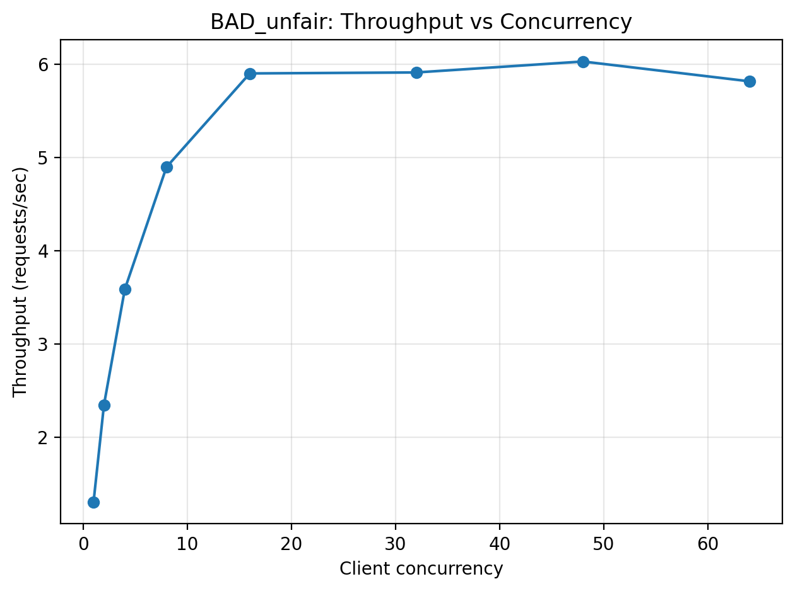
  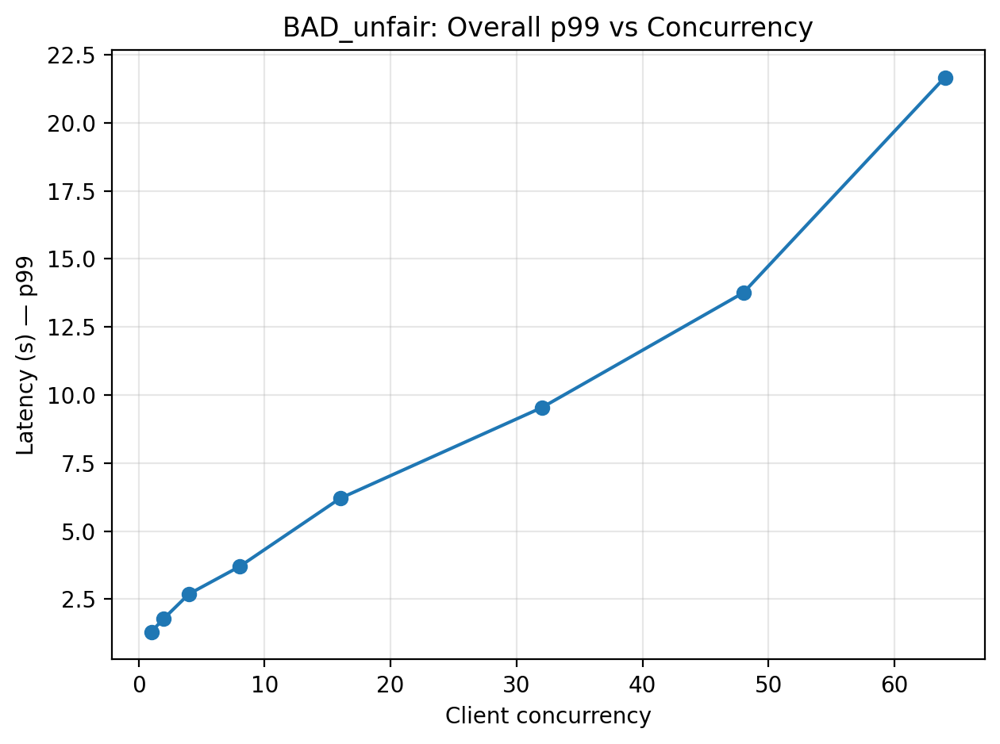

  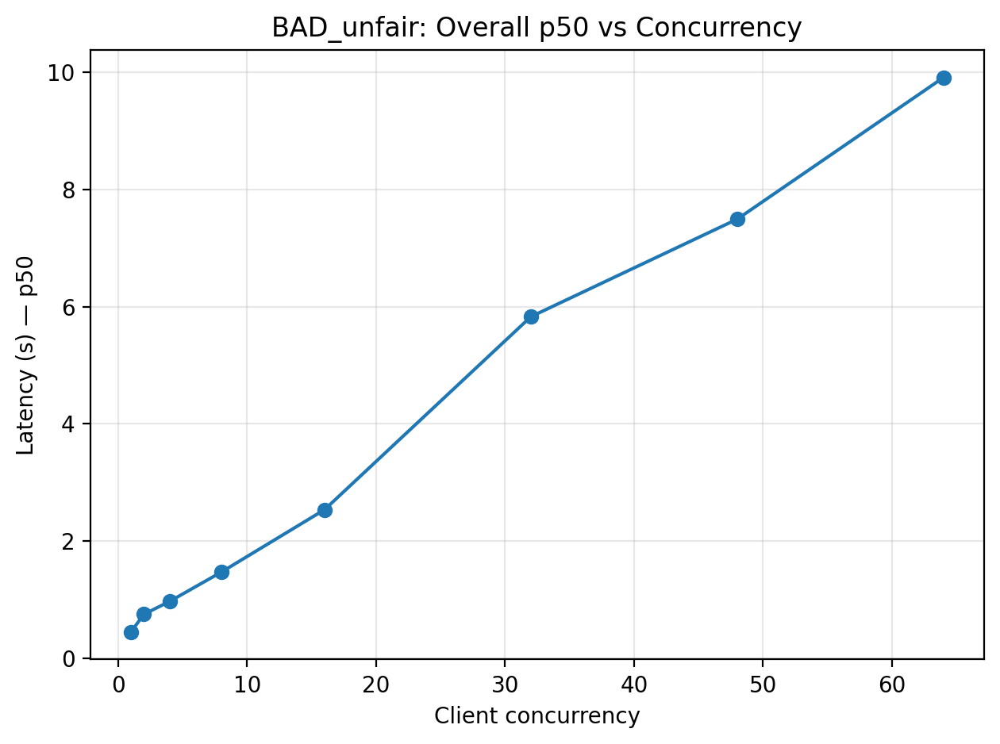
  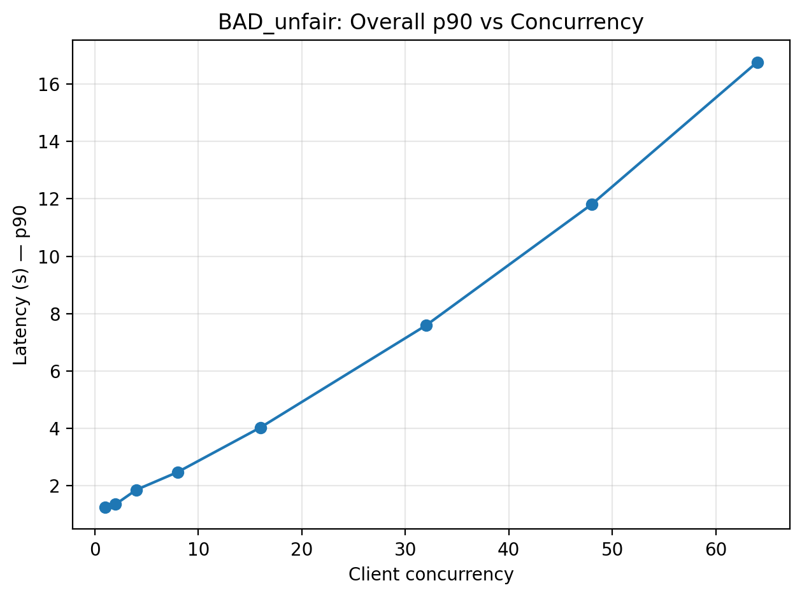

  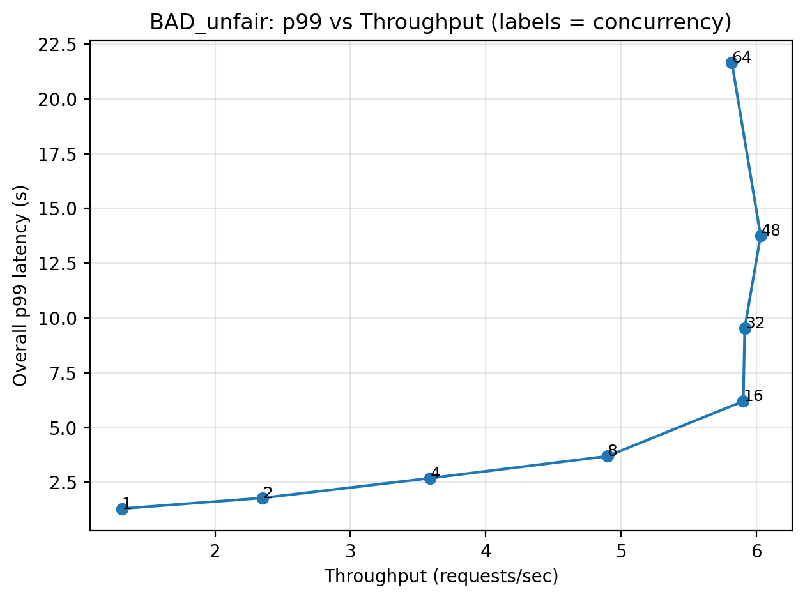
  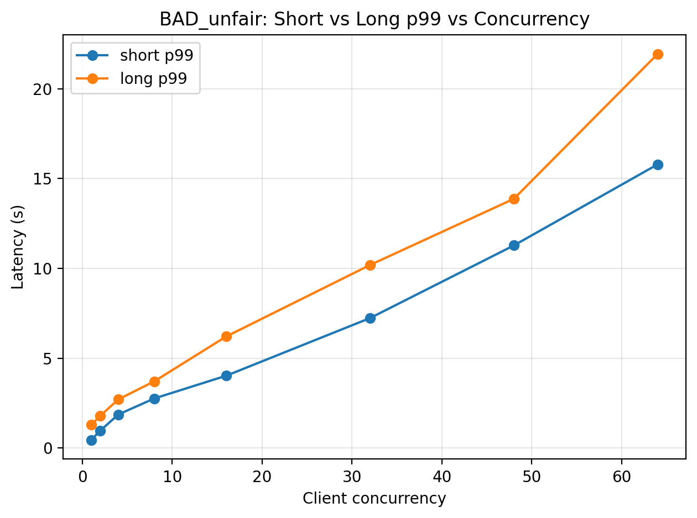

  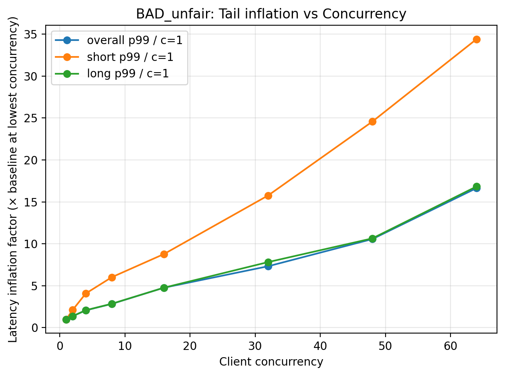
  

